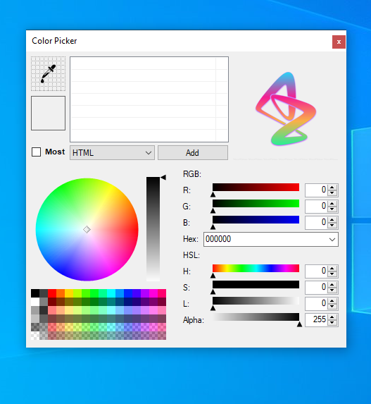
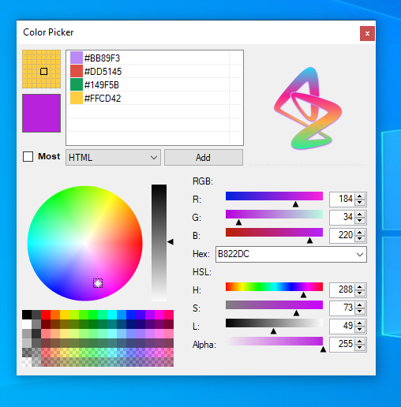

# Color-Picker-Vb.net

Youtube / https://www.youtube.com/watch?v=1NESMhYaTMU&t=65s

Professional Color Picker is a full-featured screen tool it is an all-in-one program that provides full-featured screen capture tool,
intuitive image editor,color picker, color palette and more.
User friendly and full of features for creating your image, suitable, for software developer graphic designer and home user. with Professional Color Picker identifing the colors,saving,editing and combining them into beautiful color combination.It is software for designer and digital artist. It is quick and simple job.

 

